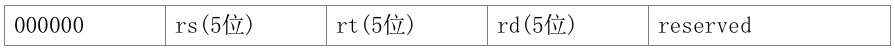
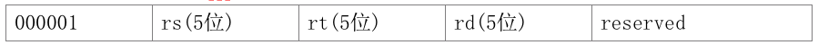
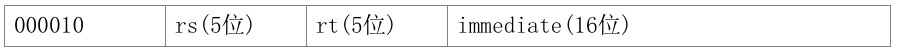
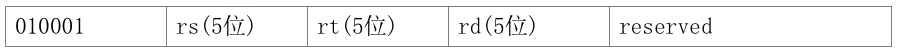
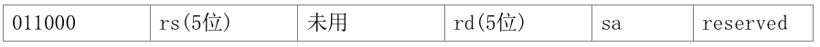
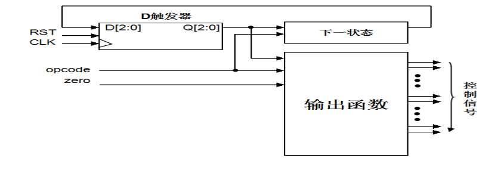
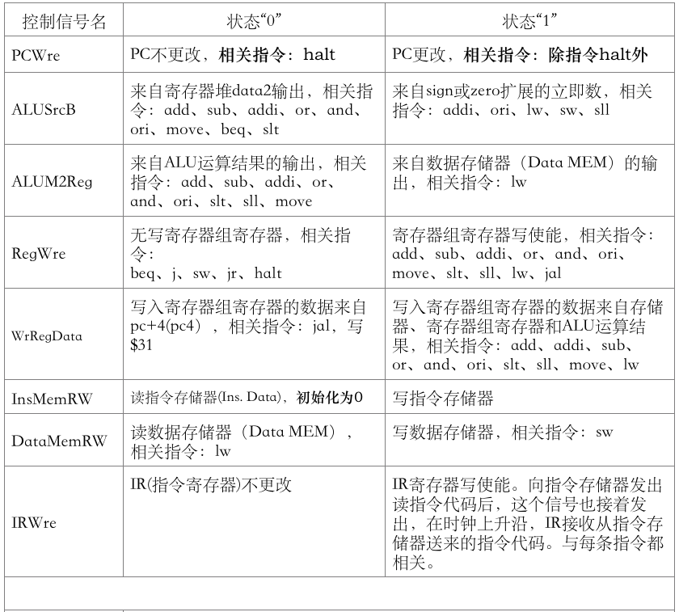
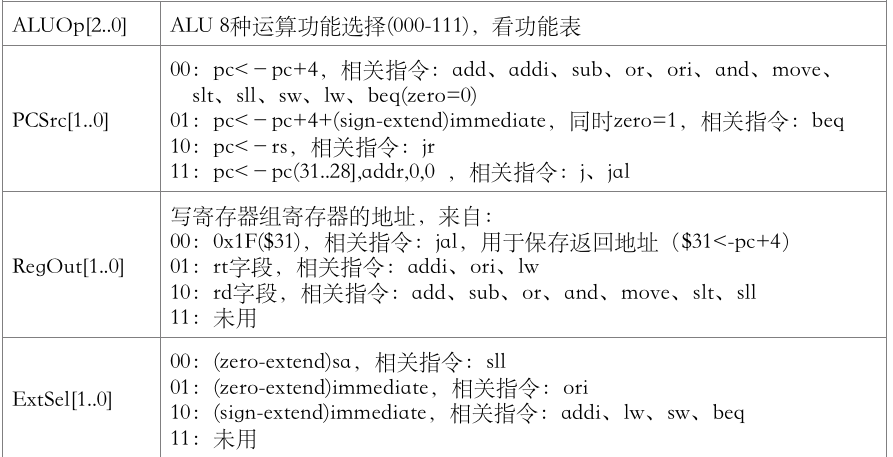

#多周期CPU设计
**需要仿真到3000ns后才结束仿真**
[TOC]

##一、 实验目的

(1) 认识和掌握多周期数据通路原理及其设计方法； 
(2) 掌握多周期CPU的实现方法，代码实现方法； 
(3) 编写一个编译器，将MIPS汇编程序编译为二进制机器码； 
(4) 掌握多周期CPU的测试方法。 

##二、 实验内容
设计一个多周期CPU，该CPU至少能实现以下指令功能操作。需设计的指令与格式如下：（说明：操作码按照以下规定使用，都给每类指令预留扩展空间，后续实验相同。）

**算术运算指令**

（1）add  rd , rs, rt
 
功能：rd<－rs + rt

（2）sub  rd , rs , rt

 
完成功能：rd<－rs － rt

（3）addi  rt , rs , immediate
 
功能：rt<－rs + (sign-extend)immediate

**逻辑运算指令**

（4）or  rd , rs , rt 
 
功能：rd<－rs | rt

（5）and  rd , rs , rt 
 
功能：rd<－rs & rt

（6）ori  rt , rs ,immediate
 
功能：rt<－rs | (zero-extend)immediate

**移位指令**
（7）sll  rd, rs,sa
 
功能：rd<－rs<<(zero-extend)sa，左移sa位 ，(zero-extend)sa

**传送指令**
（8）move  rd , rs
 
功能：rd<－rs + $0

**比较指令**
（9） slt  rd , rs , rt
 
功能：如果（rs < rt），则rd=1;  否则 rd=0

**存储器读写指令**
（10）sw  rt ,immediate(rs)
 
功能：memory[rs+ (sign-extend)immediate]<－rt

（11）lw  rt , immediate(rs)
 
功能：rt <－ memory[rs + (sign-extend)immediate]

**分支指令**
（12）beq  rs,rt,immediate (说明：immediate是从pc+4开始和转移到的指令之间间隔条数)
 
功能：if(rs=rt) pc <－pc + 4 + (sign-extend)immediate <<2

**跳转指令**
（13）j  addr
 
功能：pc < pc[31..28],addr,0,0，转移

（14）jr  rs

 
功能：pc <－ rs，转移

**调用子程序指令**
（15）jal  addr

功能：调用子程序，pc <－ pc[31..28],addr,0,0；$31<－pc+4，返回地址设置；子程序返回，需用指令 jr $31。

**停机指令**
（16）halt (停机指令)

不改变pc的值，pc保持不变。

###实验原理
多周期CPU指的是将整个CPU的执行过程分成几个阶段，每个阶段用一个时钟去完成，然后开始下一条指令的执行，而每种指令执行时所用的时钟数不尽相同，这就是所谓的多周期CPU。CPU在处理指令时，一般需要经过以下几个阶段：
    (1) 取指令(IF)：根据程序计数器pc中的指令地址，从存储器中取出一条指令，同时，pc根据指令字长度自动递增产生下一条指令所需要的指令地址，但遇到“地址转移”指令时，则控制器把“转移地址”送入pc，当然得到的“地址”需要做些变换才送入pc。
    (2) 指令译码(ID)：对取指令操作中得到的指令进行分析并译码，确定这条指令需要完成的操作，从而产生相应的操作控制信号，用于驱动执行状态中的各种操作。
    (3) 指令执行(EXE)：根据指令译码得到的操作控制信号，具体地执行指令动作，然后转移到结果写回状态。
    (4) 存储器访问(MEM)：所有需要访问存储器的操作都将在这个步骤中执行，该步骤给出存储器的数据地址，把数据写入到存储器中数据地址所指定的存储单元或者从存储器中得到数据地址单元中的数据。
    (5) 结果写回(WB)：指令执行的结果或者访问存储器中得到的数据写回相应的目的寄存器中。
    实验中就按照这五个阶段进行设计，这样一条指令的执行最长需要五个(小)时钟周期才能完成，但具体情况怎样？要根据该条指令的情况而定，有些指令不需要五个时钟周期的，这就是多周期的CPU。

MIPS32的指令的三种格式：
R类型：

I类型：

J类型：

其中 
    op：为操作码； 
    rs：为第1个源操作数寄存器，寄存器地址（编号）是00000~11111，00~1F； 
    rt：为第2个源操作数寄存器，或目的操作数寄存器，寄存器地址（同上）； 
    rd：为目的操作数寄存器，寄存器地址（同上）； 
    sa：为位移量（shift amt），移位指令用于指定移多少位； 
    func：为功能码，在寄存器类型指令中（R类型）用来指定指令的功能； 
    immediate：为16位立即数，用作无符号的逻辑操作数、有符号的算术操作数、数据加载（Laod）/数据保存（Store）指令的数据地址字节偏移量和分支指令中相对程序计数器（PC）的有符号偏移量；
    address：为地址。 

###多周期CPU状态转移图
状态的转移有的是无条件的，例如从IF状态转移到ID 和 EXE状态就是无条件的；有些是有条件的，例如ID 或 EXE状态之后不止一个状态，到底转向哪个状态由该指令功能，即指令操作码决定。每个状态代表一个时钟周期。

###多周期CPU控制部件的原理结构图
多周期CPU控制部件的电路结构，三个D触发器用于保存当前状态，是时序逻辑电路，RST用于初始化状态“000“，另外两个部分都是组合逻辑电路，一个用于产生下一个阶段的状态，另一个用于产生每个阶段的控制信号。从图上可看出，下个状态取决于指令操作码和当前状态；而每个阶段的控制信号取决于指令操作码、当前状态和反映运算结果的状态zero标志等。

###多周期CPU数据通路和控制线路图
一个简单的基本上能够在单周期上完成所要求设计的指令功能的数据通路和必要的控制线路图。其中指令和数据各存储在不同存储器中，即有指令存储器和数据存储器。访问存储器时，先给出地址，然后由读/写信号控制（1-写，0-读。当然，也可以由时钟信号控制，但必须在图上画出来）。对于寄存器组，读操作时，给出寄存器地址（编号），输出端就直接输出相应数据；而在写操作时，在 WE使能信号为1时，在时钟边沿触发写入。图中控制信号功能如表1所示，表2是ALU运算功能表。
特别提示，图上增加IR指令寄存器，目的是使指令代码保持稳定，还有pc增加写使能控制信号pcWre，也是确保pc适时修改，原因都是和多周期工作的CPU有关。ADR、BDR、ALUout、ALUM2DR四个寄存器不需要写使能信号，其作用是切分数据通路，将大组合逻辑切分为若干个小组合逻辑，大延时变为多个分段小延时。

###控制信号作用

相关部件及引脚说明： 
Instruction Memory：指令存储器 
        Iaddr，指令地址输入端口 
        DataIn，存储器数据输入端口 
        DataOut，存储器数据输出端口 
        RW，指令存储器读写控制信号，为1写，为0读 
Data Memory：数据存储器 
        Daddr，数据地址输入端口 
        DataIn，存储器数据输入端口 
        DataOut，存储器数据输出端口 
        RW，数据存储器读写控制信号，为1写，为0读 
Register File：（寄存器组） 
        Read Reg1，rs寄存器地址输入端口 
        Read Reg2，rt寄存器地址输入端口 
        Write Reg，将数据写入的寄存器，其地址输入端口（rt、rd） 
        Write Data，写入寄存器的数据输入端口 
        Read Data1，rs寄存器数据输出端口 
        Read Data2，rt寄存器数据输出端口 
        WE，写使能信号，为1时，在时钟上升沿写入 
IR：
        指令寄存器，用于存放正在执行的指令代码 
ALU： 
        result，ALU运算结果 
        zero，运算结果标志，结果为0输出1，否则输出0 

###ALU运算功能表

### 测试代码

